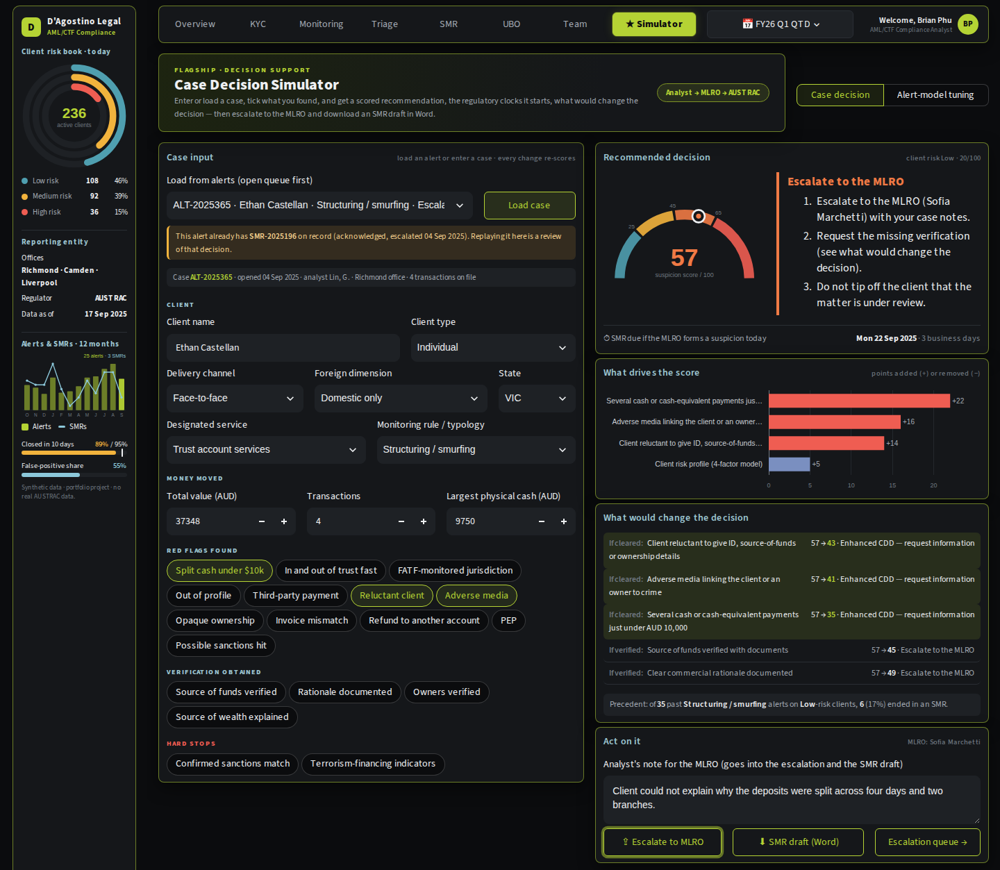
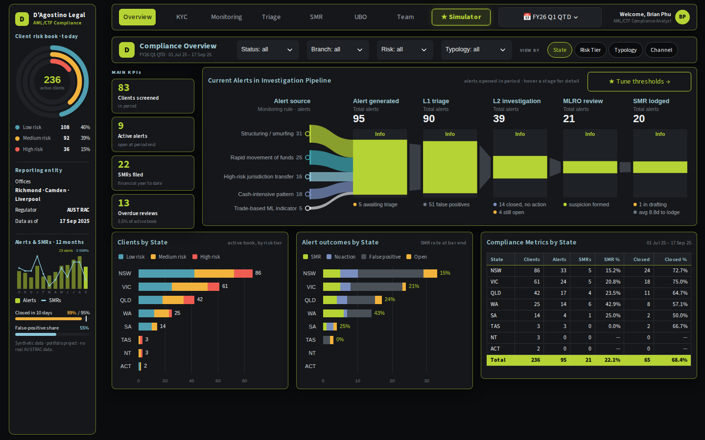
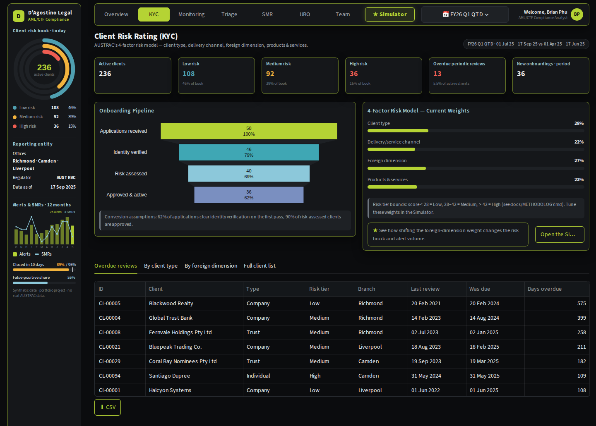
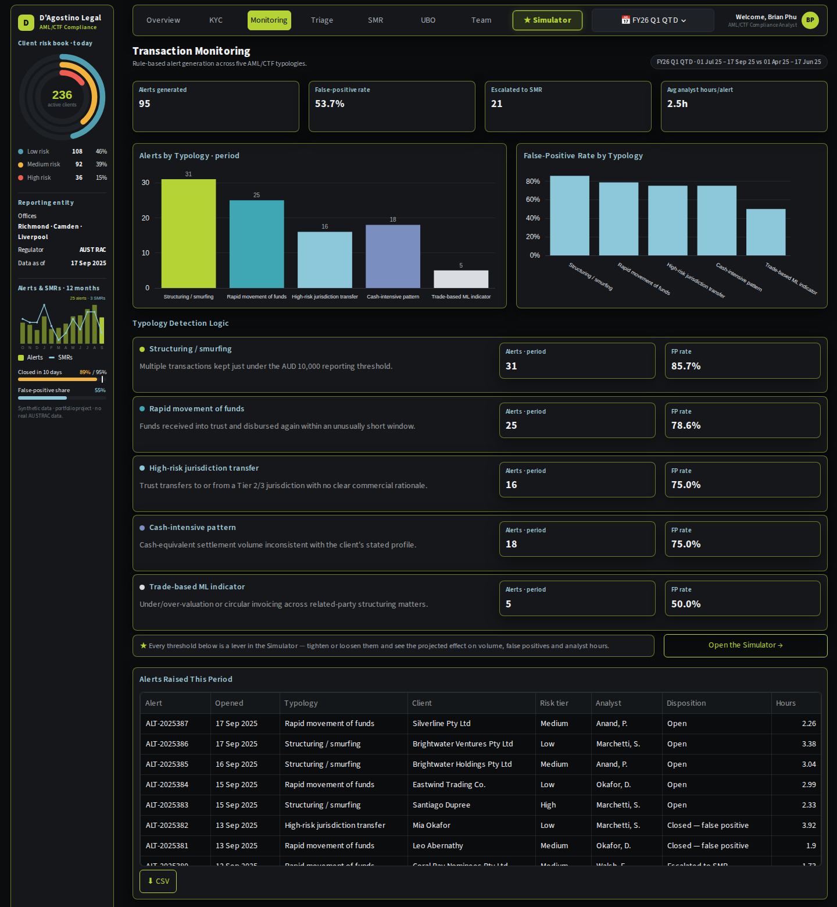
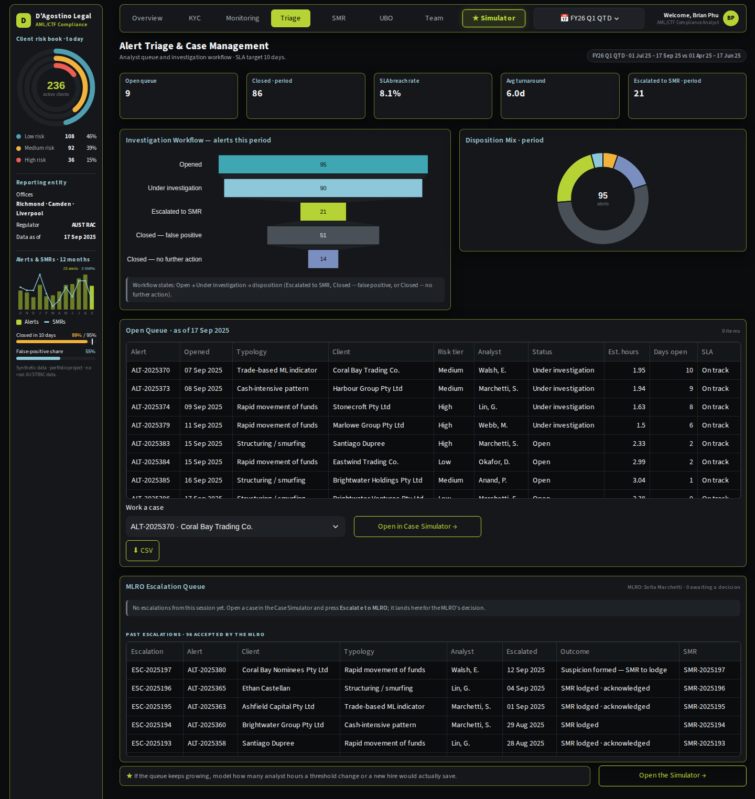
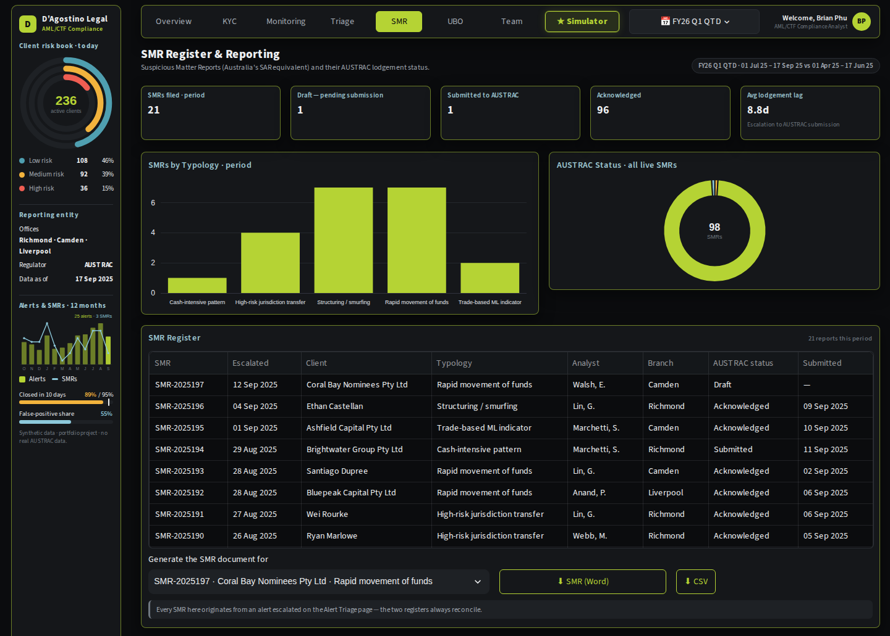
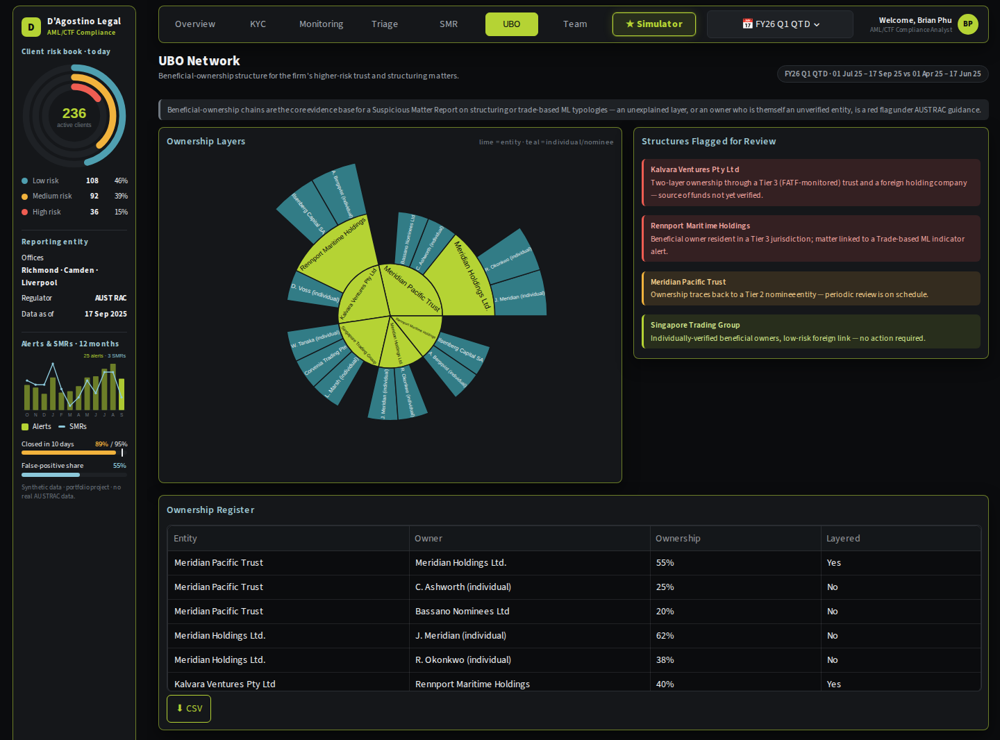
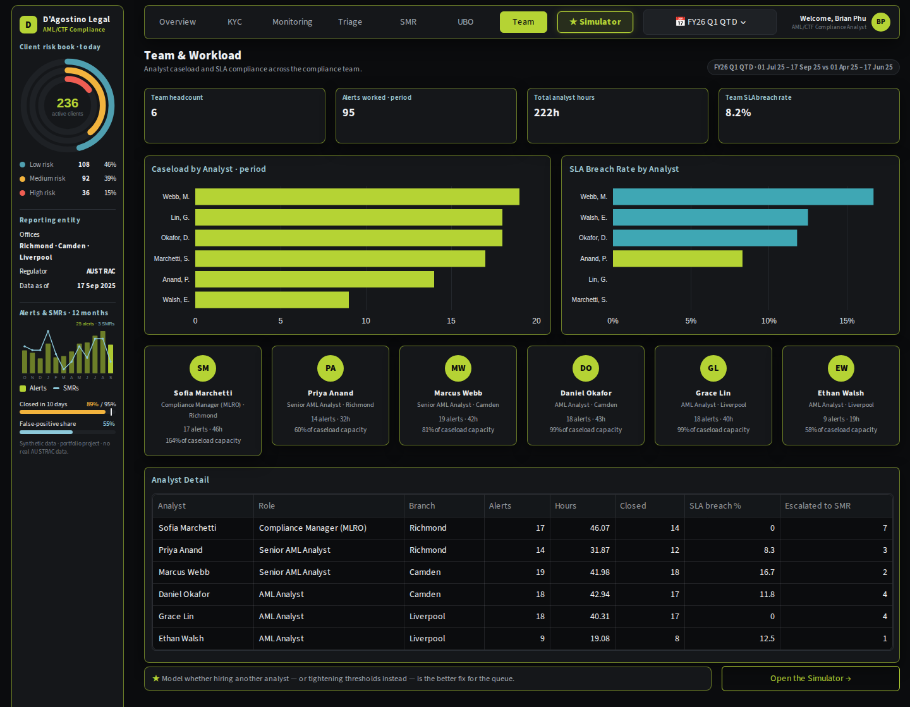
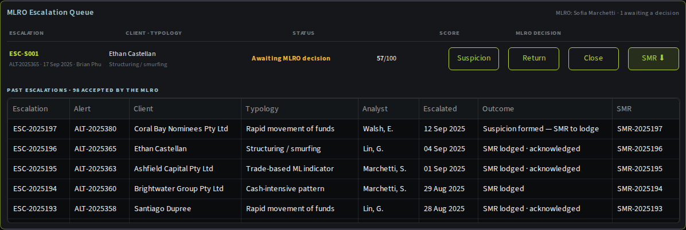
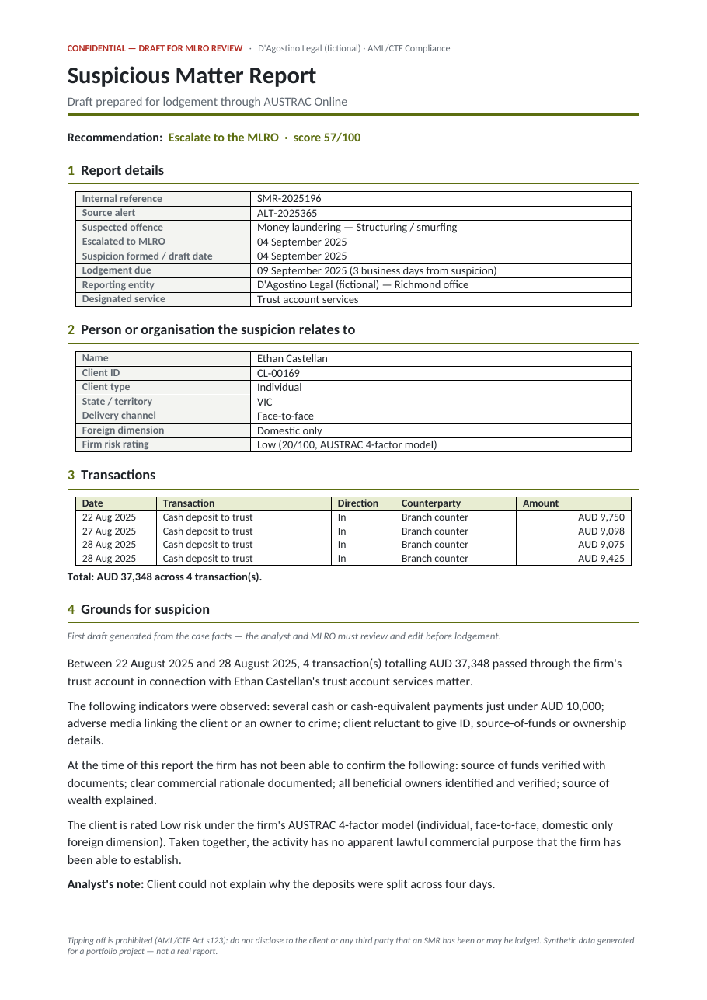

# D'Agostino Legal — AML/CTF Compliance Suite

  

An interactive AML/CTF back-office dashboard for a fictional three-office law firm, built as the companion to
the firm's financial operations dashboard — same firm, same partners, this time covering client risk
rating, transaction monitoring, alert triage, suspicious matter reporting and beneficial-ownership review.

**Why this exists:** from 1 July 2026, Australia's AML/CTF Tranche 2 reforms bring law firms, accountants and
trust and company service providers into the regime as reporting entities for the first time. A firm that has
never had to run customer due diligence, transaction monitoring or suspicious matter reporting (SMR) at scale
now has to build that function from nothing. This project is what the operational tooling behind that
function could look like.

Its centrepiece is the **★ Simulator**, which helps the officer make the call on a case: enter or load the
case, get a scored recommendation and the reporting deadlines it starts, escalate to the MLRO, and download a
Suspicious Matter Report draft as a Word document.



## ★ Flagship: the Case Decision Simulator

The hardest part of an AML analyst's day is not finding alerts but **deciding what to do with one**, and
being able to show why. The Simulator's default mode is built around that decision:

* **Enter or load a case.** Pick any alert from the queue (or start a blank case). The client's profile, the
  trust-account transactions behind the alert and the monitoring rule that fired fill in automatically. Then
  tick the red flags the investigation found, the verification obtained, and any hard stops.
* **A scored recommendation.** The case gets a 0–100 suspicion score from the client's AUSTRAC 4-factor risk,
  the value moved, the red flags and the verification. The score maps to one of four actions: close,
  enhanced CDD, escalate to the MLRO, or escalate with an SMR draft. Two hard stops override the score. A
  confirmed sanctions match means stop, freeze the funds and notify the Australian Sanctions Office.
  Terrorism-financing indicators mean the SMR is due within 24 hours.
* **The regulatory clocks.** The SMR is due 3 business days after the MLRO forms a suspicion, or 24 hours for
  terrorism financing. A threshold transaction report is due within 10 business days when physical cash
  reaches AUD 10,000. Each deadline is shown as a real date, and the tipping-off prohibition as a step.
* **What would change the decision.** Every change re-scores instantly. The panel lists which verification,
  or which cleared red flag, would move the case into a different action. A precedent line shows how past
  alerts of the same typology on same-risk clients ended.
* **Escalate, decide, report.** One click escalates the case to the MLRO with the analyst's note. On the
  Triage page the MLRO can form a suspicion (the SMR due date starts), return the case, or close it. An **SMR
  draft in Word** can be downloaded at any point. It has seven sections: report details, subject, transactions,
  grounds for suspicion (a first-draft narrative built from the case facts), indicators and verification,
  action taken, and sign-off. Every past SMR on the SMR page can be downloaded the same way.

**Worked example (synthetic data).** Alert ALT-2025365 is four cash deposits of AUD 9,098–9,750 in one week
(AUD 37,348 in total) for a Low-risk individual. The investigation also found adverse media and a client
reluctant to explain the source of funds, so the case scores **57/100: Escalate to the MLRO**, with the SMR
due Mon 22 Sep 2025 if a suspicion is formed. Had the client explained the funds, the reluctance flag would
clear and the case would drop to 43, which is enhanced CDD rather than escalation. Of 35 past structuring
alerts on Low-risk clients, 6 (17%) ended in an SMR.

The scoring weights are an illustrative model documented in [docs/METHODOLOGY.md](docs/METHODOLOGY.md#4-case-decision-scoring),
not an AUSTRAC formula. The engine recommends and the MLRO decides.

**Second mode: alert-model tuning.** The same page also has a model-governance mode. Change the five
monitoring-rule thresholds, the foreign-dimension risk weight, headcount or handling time and see the projected
effect on alert volume, false positives, analyst hours and SLA risk. A goal-seek finds the setting that hits a
target. On the sample data, cutting the monthly queue by 4% needs about **+13% on the structuring threshold**.
Details: [docs/SIMULATOR.md](docs/SIMULATOR.md).

## In one minute

| The question | Where to look |
|---|---|
| **What should I do with this case, and when is the report due?** | **★ Simulator** (case decision → MLRO escalation → SMR draft in Word) |
| What should we change in the alert engine, and what would it take? | **★ Simulator**, alert-model tuning mode (levers, goal-seek, delivery risk) |
| Are our clients risk-rated correctly, and are periodic reviews overdue? | **KYC** (AUSTRAC 4-factor risk model, onboarding funnel, overdue reviews) |
| What suspicious activity is the monitoring engine catching? | **Monitoring** (five typologies, false-positive rates, detection logic) |
| Is the alert queue being worked to SLA, and what is waiting for the MLRO? | **Triage** (investigation workflow, SLA status, MLRO escalation queue) |
| What have we reported to AUSTRAC? | **SMR** (suspicious matter register, AUSTRAC submission status, SMR documents in Word) |
| Who really owns the entities we act for? | **UBO** (beneficial-ownership network, structures flagged for review) |
| Is the compliance team keeping up with the workload? | **Team** (caseload, SLA-breach rate, utilisation by analyst) |

The **Overview** puts the whole compliance posture on one screen (no scrolling on a 1440×900 laptop): four headline
KPIs, the alert investigation pipeline from monitoring rule to lodged SMR (alert → L1 triage → L2 investigation →
MLRO review → SMR, with the drop-out at each step), and a breakdown of clients and alert outcomes by state, risk
tier, typology or onboarding channel. The sidebar's radial chart shows the whole client book by risk tier.



## Example findings (from the synthetic data)

These come straight from the model, so they match what you see when you run it (quarter-to-date, 1 Jul – 17
Sep 2025):

* **The client book is meaningfully high-risk.** Of 236 active clients, 36 (15%) sit in the High risk
  tier and 92 (39%) in Medium, under the AUSTRAC 4-factor model (client type, delivery channel, foreign
  dimension, products & services).
* **13 periodic reviews are genuinely overdue**, not just due soon — a realistic backlog for a team of six
  analysts covering 236 clients.
* **95 alerts opened this quarter**, led by structuring/smurfing (31) and rapid movement of funds (25); 54
  closed as false positives and 21 escalated to a suspicious matter report.
* **22 SMRs filed year-to-date**, with 4 investigations still open in the queue.
* **The Simulator says:** the base run-rate is 22.8 alerts a month at a 55.2% false-positive rate and 55
  analyst hours (55% of team capacity). Tightening thresholds cuts that to 19.9 alerts and 51.2% false
  positives, while hiring one analyst alone drops capacity utilisation from 55% to 44% without touching a
  single detection rule.

## More screenshots

| | |
|---|---|
|  **Client risk rating (KYC)** |  **Transaction monitoring** |
|  **Alert triage & case management** |  **SMR register & AUSTRAC reporting** |
|  **Beneficial-ownership network** |  **Team & workload** |
|  **MLRO escalation queue** |  **SMR draft (Word) — [open the sample](docs/samples/SMR-2025196_draft.docx)** |

## What this project demonstrates

**AML/CTF and compliance domain knowledge**
* Client risk rating against AUSTRAC's 4-factor model (client type, delivery/service channel, foreign
  dimension, products & services), risk tiering and a periodic-review schedule that scales with risk.
* Transaction monitoring typologies: structuring/smurfing, rapid movement of funds, high-risk jurisdiction
  transfers, cash-intensive patterns and trade-based money laundering indicators.
* Alert lifecycle: triage, disposition (false positive / no further action / escalation), SLA management,
  and the escalation path from alert to suspicious matter report (SMR).
* Case decision-making: red flags vs verification, enhanced CDD, escalation to the MLRO, and the SMR (3 business
  days; 24 hours for terrorism financing), TTR (physical cash of AUD 10,000 or more) and tipping-off rules
  applied to a live case.
* Writing a Suspicious Matter Report: a Word draft laid out after AUSTRAC Online's sections, with a
  grounds-for-suspicion narrative built from the case facts.
* AUSTRAC SMR register and reporting-status tracking (draft / submitted / acknowledged).
* Beneficial-ownership (UBO) analysis and structures-flagged-for-review reasoning.
* Regulatory-change context: Australia's AML/CTF Tranche 2 reforms bringing legal practitioners into scope
  from 1 July 2026.
* Decision analysis for a compliance function: threshold tuning trade-offs (volume vs false positives vs
  coverage), goal-seek, delivery-risk haircuts, and hiring economics — the kind of case a Compliance Officer
  has to make to a Risk Committee.

**Engineering**
* Python, pandas, NumPy, Plotly and Streamlit, organised into a model layer, a metrics layer, a simulation
  engine and page modules — the same architecture as the companion financial dashboard.
* One deterministic model as the single source of truth, so every page reconciles to every other page.
* Word document generation (python-docx) for SMR drafts, verified by opening the generated files in the tests.
* **119 automated tests** (run against both the oldest supported dependency versions and the latest): reconciliation checks (the alert ledger sums to the typology and analyst tables,
  every SMR traces to an escalated alert, risk tiers match the model's own bounds), the case-decision rules
  (bands, hard stops, business-day deadlines, TTR threshold), simulator maths (goal-seek answers land exactly on
  target), the SMR Word draft's contents, and browser-style tests that click buttons and edit controls, including
  regression tests for past bugs.
* Continuous integration on GitHub Actions.

Method notes: [docs/METHODOLOGY.md](docs/METHODOLOGY.md) (every KPI and model formula) ·
[docs/SIMULATOR.md](docs/SIMULATOR.md) (the Simulator) · [docs/ARCHITECTURE.md](docs/ARCHITECTURE.md) (how the
code fits together).

## Run it locally

```bash
git clone <repository-url>          # the green "Code" button on this page gives you the URL
cd dagostino-legal-amlctf-suite
python -m venv .venv && source .venv/bin/activate      # Windows: .venv\Scripts\activate
pip install -r requirements.txt
streamlit run app.py
```

Tested with Python 3.12, Streamlit 1.64, pandas 3.0 and Plotly 7.1. Best viewed in a browser window at least
1280 px wide. The model builds in about a second and is cached.

**Tests:** `pip install -r requirements-dev.txt && python -m pytest -q`

## Deploy your own copy (free)

1. Push the repository to your GitHub account.
2. Go to [share.streamlit.io](https://share.streamlit.io), sign in with GitHub and choose **New app**.
3. Select the repository, branch `main`, main file `app.py`; under *Advanced settings* choose Python 3.12.
4. Optionally add the resulting URL to the top of this README as a live-demo link.

If Streamlit Cloud shows *"Error running app"*, open **Manage app → logs**: it is almost always dependency
installation, not the code. `No module named 'docx'` means the deployed commit predates `python-docx` in
`requirements.txt` (push again and reboot); `No matching distribution` means the app is on a Python version
older than the pins allow (set Python 3.12 in *Advanced settings* and reboot). The app is tested against the
floors in `requirements.txt` (Streamlit 1.49, pandas 2.2, NumPy 1.26, Plotly 5.24) as well as the latest
releases, so both old and new Python versions on Cloud can resolve it.

## Data, assumptions and disclaimers

* **All data is synthetic.** The firm, its clients, staff, alerts and SMRs are entirely fictional, generated
  from a fixed random seed so every run of the app produces the same numbers.
* **This is not an AML/CTF compliance program.** It does not implement an actual transaction-monitoring
  system, does not connect to AUSTRAC, and should not be read as legal or regulatory advice. It demonstrates
  how the reporting and decision-support layer around such a program could be built.
* **Jurisdiction and entity names in the foreign-dimension and UBO data are fictional** (e.g. "Corvenia",
  "Meridia"), chosen to avoid implying anything about any real country.
* **Simulator results are decision aids, not forecasts.** They project from historical typology behaviour and
  hold client mix and criminal behaviour constant apart from the levers moved.
* Alert dispositions, SLA breaches and SMR timing are generated by the model, not observed from any real
  matter or client.

## Development notes

This project was developed iteratively with AI assistance (Anthropic's Claude) working from the author's
requirements. The compliance definitions are documented in [docs/METHODOLOGY.md](docs/METHODOLOGY.md) and are
covered by the automated tests, so they can be checked and challenged independently of how the code was
written.

## Author

Built by Brian Phu, AML/CTF Compliance Analyst. Licensed under the [MIT License](LICENSE).
