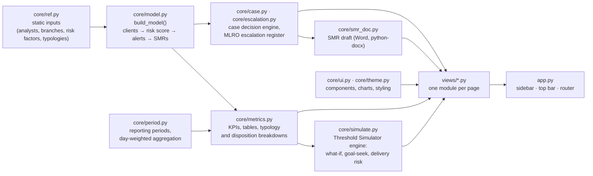

# Architecture

The app is a thin Streamlit layer over a deterministic compliance model. Data flows one way:

## Layers

| Layer | Files | Responsibility |
|---|---|---|
| Inputs | `core/ref.py` | Fixed reference data: analysts, branches, the AUSTRAC 4-factor risk model's factor points and weights, the five typologies, named clients and the UBO ownership map. Change the as-of date, team or typology definitions here. |
| Model | `core/model.py` | Builds the client register (risk-scored, tiered, with a periodic-review schedule), the alert ledger, and the SMR register from one fixed random seed. Deterministic. |
| Periods | `core/period.py` | Presets, comparison windows, and the day-weighted aggregation that makes any date range reconcile — reused unchanged from the companion operations dashboard. |
| Metrics | `core/metrics.py` | Pure functions from (model, period) to KPIs and tables. No Streamlit calls. |
| Case decision | `core/case.py`, `core/escalation.py`, `core/smr_doc.py` | The Simulator's default mode: case scoring, recommendation bands, hard stops, SMR/TTR deadlines, what-if and precedent; the analyst → MLRO escalation register; the SMR draft as a Word document. Pure functions, unit-tested. |
| Simulation | `core/simulate.py` | The Alert Threshold & Model Tuning Simulator's engine: projected alert volume/FP rate/hours/SLA risk/coverage, goal-seek, delivery-risk range, lever ranking. Pure functions, unit-tested. |
| Presentation | `core/ui.py`, `core/theme.py`, `.streamlit/config.toml` | Formatters, KPI cards, reusable chart helpers, the sidebar radial chart, and the dark "lime" theme: design tokens in `core/theme.py`, CSS injected with `st.html` (never `st.markdown`, so blank lines in the CSS can't truncate the block), and the matching Streamlit widget theme in `.streamlit/config.toml`. |
| Pages | `views/` | One module per page: Overview, KYC, Monitoring, Triage (incl. the MLRO escalation queue), SMR, UBO, Team, Simulator (`simulator.py` switches between `case_sim.py` and the tuning view). |
| Entry point | `app.py` | Builds the model once (cached), draws the sidebar and top bar, and routes to a page. |

## Design decisions

* **One source of truth.** Pages never compute their own versions of a number; they ask `metrics.py`, which reads the model. That is
  why the reconciliation tests can assert that, for example, the typology table sums to the same alert count as the triage queue.
* **Deterministic, seeded synthetic data.** Every client, alert and SMR is generated once from a fixed seed (`core/model.py`, `SEED`),
  so every page — and the README's "Example findings" — always shows the same numbers.
* **Full-month equivalents plus day weighting**, the same convention as the companion dashboard: the in-progress month's counts are
  rescaled to a full-month equivalent so `core.period.flow()` reproduces the true observed count for any period ending mid-month.
* **Pure functions for analysis.** `metrics.py` and `simulate.py` take data in and return data out, which makes them easy to unit-test
  without a browser.
* **Model cached with `st.cache_resource`.** It builds in about one second on first load.
* **Session state** holds the selected page and reporting period. Streamlit forgets a widget's value when its page is not drawn, so the
  Simulator's levers are saved and restored (`ui.restore_state` / `ui.keep_state`) and survive navigating away and back.
* **Callbacks for buttons that change widgets.** Presets, Reset and the goal-seek Apply buttons use `on_click` callbacks — the only safe
  way to change a slider's value after it has already been drawn (a direct `st.session_state[key] = value` after the widget is
  instantiated raises `StreamlitWidgetAlreadyInstantiatedError`).

## Extending it

* **Real data:** replace `build_model()` with a loader that returns the same structures (`cust`, `alerts`, `smrs`, `fin`, `stock`; see
  the top of `core/model.py`). Pages read only from this dictionary, but column names and typology definitions would need adapting.
* **A new page:** add `views/<name>.py` with `render(M, cur, cmp)` and register it in `PAGES` (`app.py`) and `NAV_ITEMS` (`core/ref.py`).
* **A new typology:** add an entry to `TYPOLOGIES` in `core/ref.py` and a lever in `core/simulate.py`'s `LEVER_TYPOLOGY`/`BOUNDS` — the
  Monitoring page, the Overview pipeline funnel and the Simulator's tornado/bridge pick it up automatically.
