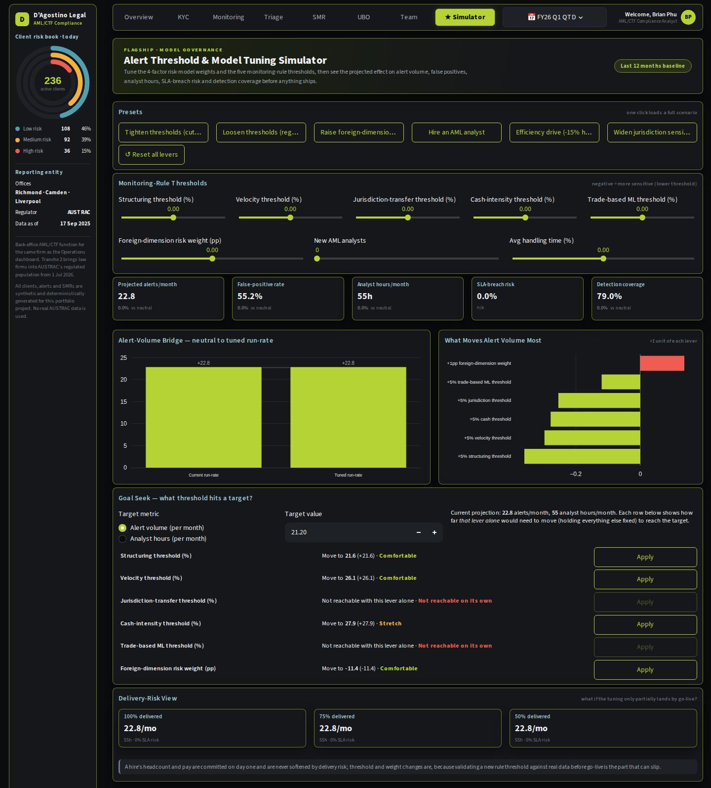
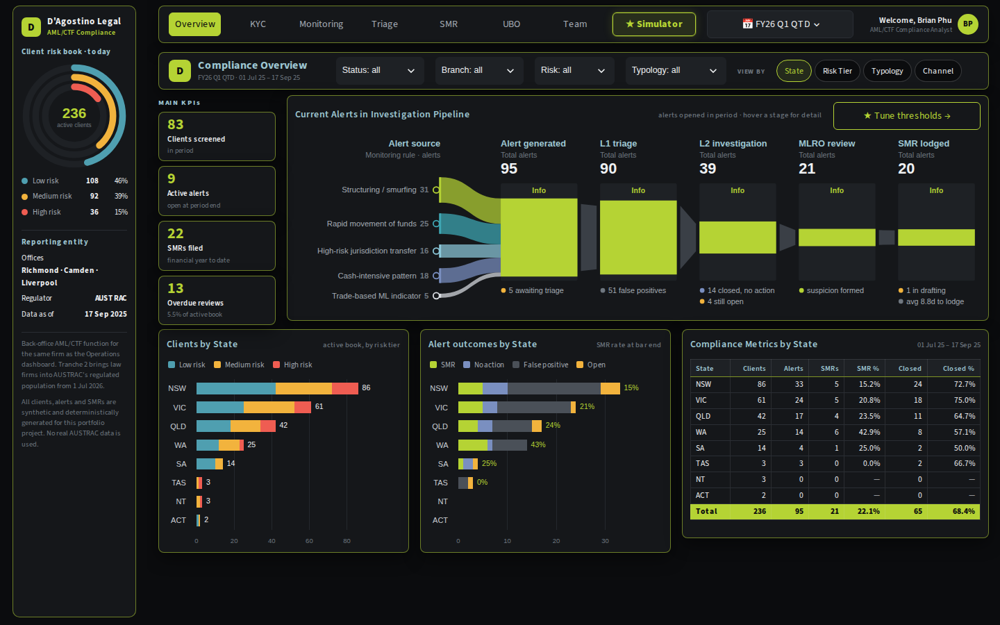
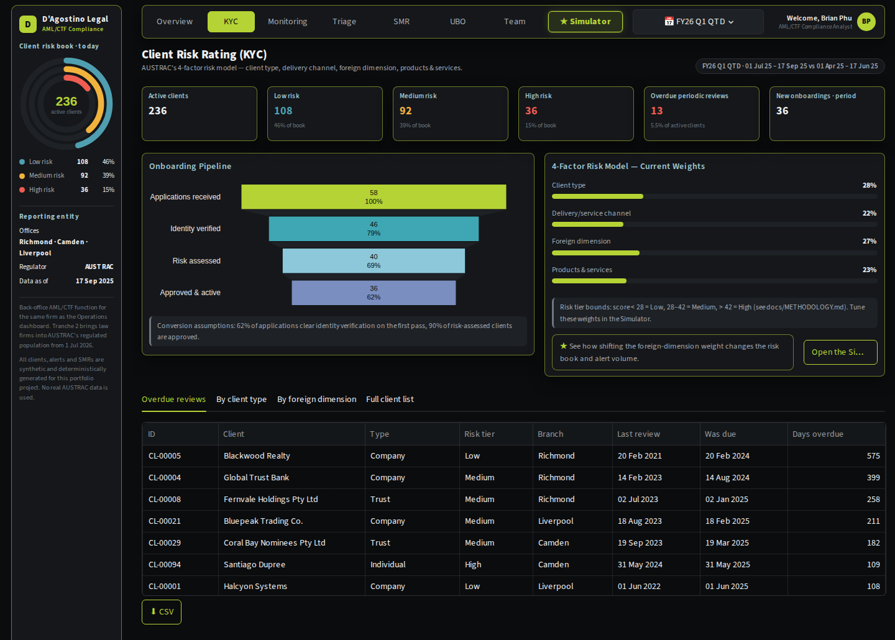
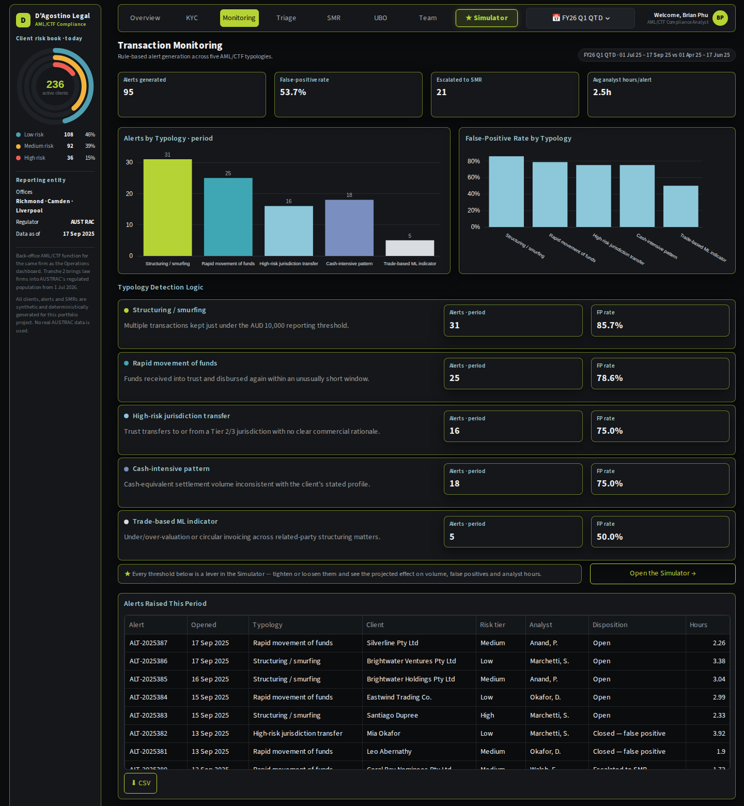
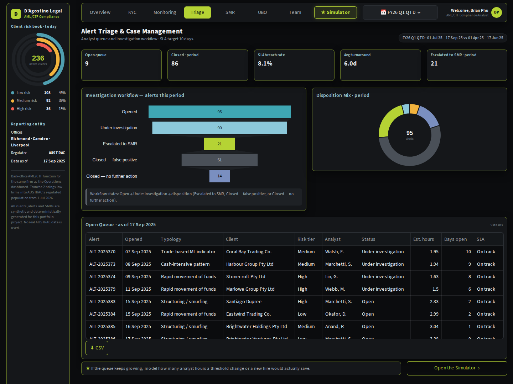
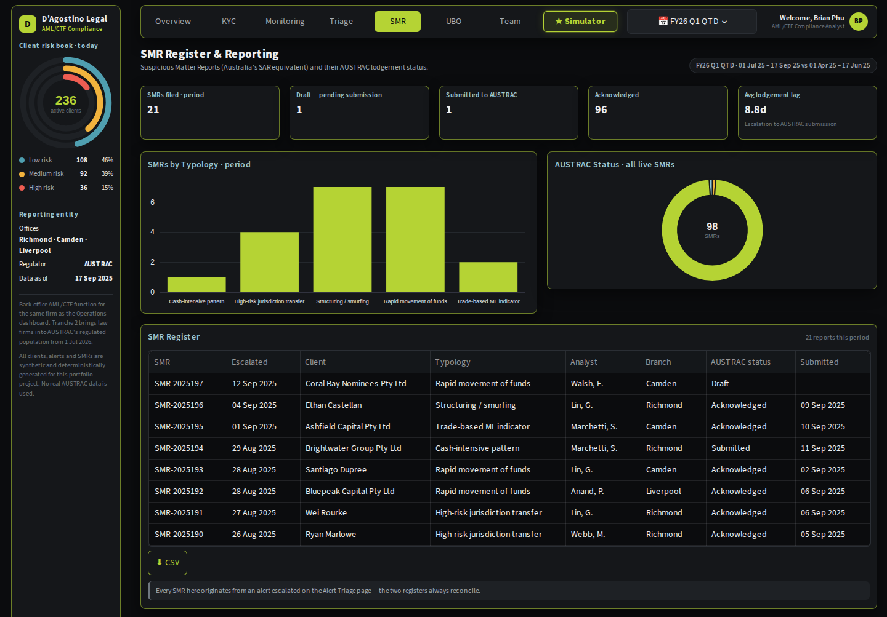
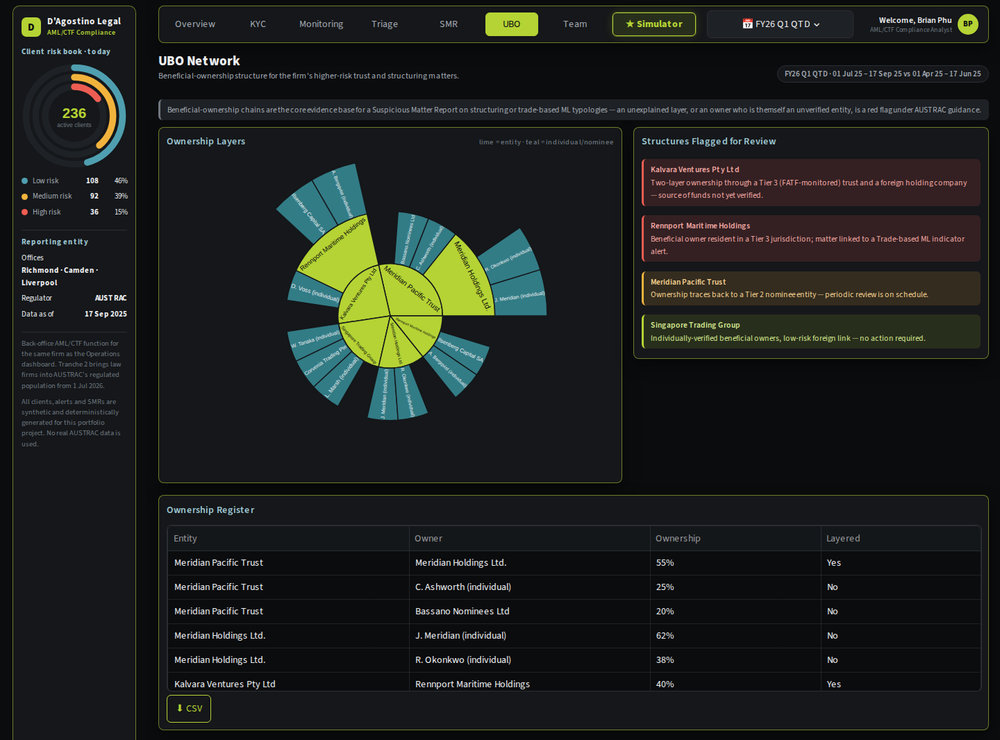
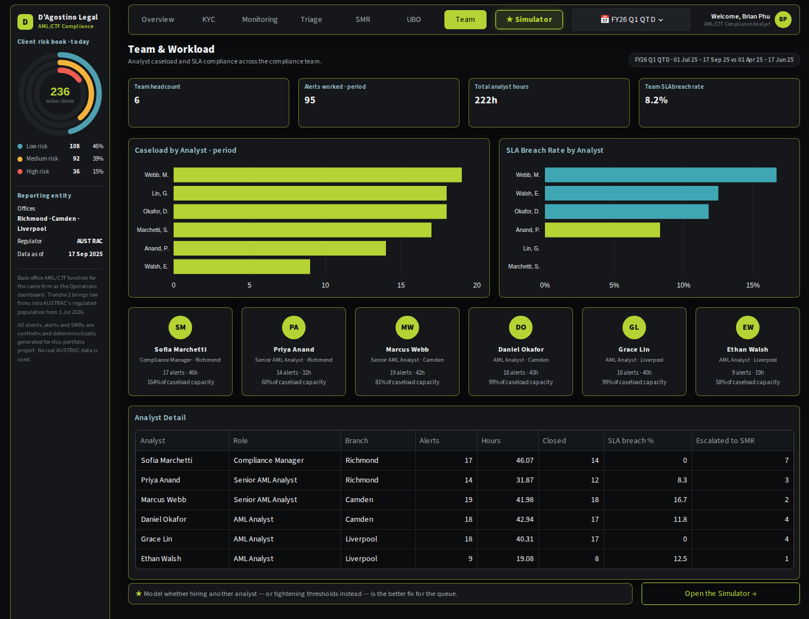

# D'Agostino Legal — AML/CTF Compliance Suite

  

An interactive AML/CTF back-office dashboard for a fictional three-office law firm, built as the companion to
the firm's financial operations dashboard — same firm, same partners, this time covering client risk
rating, transaction monitoring, alert triage, suspicious matter reporting and beneficial-ownership review.

**Why this exists:** from 1 July 2026, Australia's AML/CTF Tranche 2 reforms bring law firms, accountants and
trust and company service providers into the regime as reporting entities for the first time. A firm that has
never had to run customer due diligence, transaction monitoring or suspicious matter reporting (SMR) at scale
now has to build that function from nothing. This project is what the operational tooling behind that
function could look like.

Its centrepiece is the **★ Simulator**: before changing a detection rule or asking for headcount, see the
effect on alert volume, false positives, analyst hours and SLA risk — and what it would take to hit a target.



## ★ Flagship: the Alert Threshold & Model Tuning Simulator

A compliance analyst's most useful question before a Compliance Committee meeting is not "how many alerts did
we get?" but **"what should we change, and what will it cost us?"** The Simulator answers that on the last 12
months of actuals:

* **One-click scenarios.** Tighten thresholds, loosen them under regulator pressure, raise the foreign-dimension
  risk weight, hire an analyst, or run an efficiency drive — then fine-tune any lever.
* **Five levers that matter.** Per-typology detection thresholds (structuring, velocity, jurisdiction, cash,
  trade-based ML), the foreign-dimension risk weight, headcount and average handling time.
* **"What would it take?" (goal-seek).** Pick a target alert volume or analyst-hours figure and see how far
  each lever must move on its own. On the sample data, a 4% cut in the monthly queue needs about
  **+13% on the structuring threshold**, or **+16% on the velocity threshold**, or **−7 pp on the
  foreign-dimension weight** — one click applies the answer to the sliders.
* **"How sure are we?"** Shows the result if only 100% / 75% / 50% of a tuning change actually lands by
  go-live. A new hire's cost is never softened — only threshold/weight tuning work is modelled as able to slip.
* **Real capacity economics.** Hiring one AML analyst lifts monthly team capacity from 100 to 124 hours, cutting
  utilisation from 55% to 44% without touching a single detection rule.
* **Joined up with the analysis.** The Overview, KYC and Team pages link straight into the Simulator with the
  right preset pre-loaded, and your levers are kept as you move around the app.

Method, formulas and worked examples: [docs/SIMULATOR.md](docs/SIMULATOR.md).

## In one minute

| The question | Where to look |
|---|---|
| **What should we change in the alert engine, and what would it take?** | **★ Simulator** (levers, goal-seek, delivery risk, presets) |
| Are our clients risk-rated correctly, and are periodic reviews overdue? | **KYC** (AUSTRAC 4-factor risk model, onboarding funnel, overdue reviews) |
| What suspicious activity is the monitoring engine catching? | **Monitoring** (five typologies, false-positive rates, detection logic) |
| Is the alert queue being worked to SLA? | **Triage** (investigation workflow, disposition mix, SLA status) |
| What have we reported to AUSTRAC? | **SMR** (suspicious matter register, AUSTRAC submission status) |
| Who really owns the entities we act for? | **UBO** (beneficial-ownership network, structures flagged for review) |
| Is the compliance team keeping up with the workload? | **Team** (caseload, SLA-breach rate, utilisation by analyst) |

The **Overview** puts the whole compliance posture on one screen (no scrolling on a 1440×900 laptop): four headline
KPIs, the alert investigation pipeline from monitoring rule to lodged SMR (alert → L1 triage → L2 investigation →
MLRO review → SMR, with the drop-out at each step), and a breakdown of clients and alert outcomes by state, risk
tier, typology or onboarding channel. The sidebar's radial chart shows the whole client book by risk tier.



## Example findings (from the synthetic data)

These come straight from the model, so they match what you see when you run it (quarter-to-date, 1 Jul – 17
Sep 2025):

* **The client book is meaningfully high-risk.** Of 236 active clients, 36 (15%) sit in the High risk
  tier and 92 (39%) in Medium, under the AUSTRAC 4-factor model (client type, delivery channel, foreign
  dimension, products & services).
* **13 periodic reviews are genuinely overdue**, not just due soon — a realistic backlog for a team of six
  analysts covering 236 clients.
* **95 alerts opened this quarter**, led by structuring/smurfing (31) and rapid movement of funds (25); 54
  closed as false positives and 21 escalated to a suspicious matter report.
* **22 SMRs filed year-to-date**, with 4 investigations still open in the queue.
* **The Simulator says:** the base run-rate is 22.8 alerts a month at a 55.2% false-positive rate and 55
  analyst hours (55% of team capacity). Tightening thresholds cuts that to 19.9 alerts and 51.2% false
  positives, while hiring one analyst alone drops capacity utilisation from 55% to 44% without touching a
  single detection rule.

## More screenshots

| | |
|---|---|
|  **Client risk rating (KYC)** |  **Transaction monitoring** |
|  **Alert triage & case management** |  **SMR register & AUSTRAC reporting** |
|  **Beneficial-ownership network** |  **Team & workload** |

## What this project demonstrates

**AML/CTF and compliance domain knowledge**
* Client risk rating against AUSTRAC's 4-factor model (client type, delivery/service channel, foreign
  dimension, products & services), risk tiering and a periodic-review schedule that scales with risk.
* Transaction monitoring typologies: structuring/smurfing, rapid movement of funds, high-risk jurisdiction
  transfers, cash-intensive patterns and trade-based money laundering indicators.
* Alert lifecycle: triage, disposition (false positive / no further action / escalation), SLA management,
  and the escalation path from alert to suspicious matter report (SMR).
* AUSTRAC SMR register and reporting-status tracking (draft / submitted / acknowledged).
* Beneficial-ownership (UBO) analysis and structures-flagged-for-review reasoning.
* Regulatory-change context: Australia's AML/CTF Tranche 2 reforms bringing legal practitioners into scope
  from 1 July 2026.
* Decision analysis for a compliance function: threshold tuning trade-offs (volume vs false positives vs
  coverage), goal-seek, delivery-risk haircuts, and hiring economics — the kind of case a Compliance Officer
  has to make to a Risk Committee.

**Engineering**
* Python, pandas, NumPy, Plotly and Streamlit, organised into a model layer, a metrics layer, a simulation
  engine and page modules — the same architecture as the companion financial dashboard.
* One deterministic model as the single source of truth, so every page reconciles to every other page.
* **70 automated tests:** reconciliation checks (the alert ledger sums to the typology and analyst tables,
  every SMR traces to an escalated alert, risk tiers match the model's own bounds), simulator maths (goal-seek
  answers land exactly on target), and browser-style tests that click buttons and edit controls, including
  regression tests for past bugs.
* Continuous integration on GitHub Actions.

Method notes: [docs/METHODOLOGY.md](docs/METHODOLOGY.md) (every KPI and model formula) ·
[docs/SIMULATOR.md](docs/SIMULATOR.md) (the Simulator) · [docs/ARCHITECTURE.md](docs/ARCHITECTURE.md) (how the
code fits together).

## Run it locally

```bash
git clone <repository-url>          # the green "Code" button on this page gives you the URL
cd dagostino-legal-amlctf-suite
python -m venv .venv && source .venv/bin/activate      # Windows: .venv\Scripts\activate
pip install -r requirements.txt
streamlit run app.py
```

Tested with Python 3.12, Streamlit 1.64, pandas 3.0 and Plotly 7.1. Best viewed in a browser window at least
1280 px wide. The model builds in about a second and is cached.

**Tests:** `pip install -r requirements-dev.txt && python -m pytest -q`

## Deploy your own copy (free)

1. Push the repository to your GitHub account.
2. Go to [share.streamlit.io](https://share.streamlit.io), sign in with GitHub and choose **New app**.
3. Select the repository, branch `main`, main file `app.py`; under *Advanced settings* choose Python 3.12.
4. Optionally add the resulting URL to the top of this README as a live-demo link.

## Data, assumptions and disclaimers

* **All data is synthetic.** The firm, its clients, staff, alerts and SMRs are entirely fictional, generated
  from a fixed random seed so every run of the app produces the same numbers.
* **This is not an AML/CTF compliance program.** It does not implement an actual transaction-monitoring
  system, does not connect to AUSTRAC, and should not be read as legal or regulatory advice. It demonstrates
  how the reporting and decision-support layer around such a program could be built.
* **Jurisdiction and entity names in the foreign-dimension and UBO data are fictional** (e.g. "Corvenia",
  "Meridia"), chosen to avoid implying anything about any real country.
* **Simulator results are decision aids, not forecasts.** They project from historical typology behaviour and
  hold client mix and criminal behaviour constant apart from the levers moved.
* Alert dispositions, SLA breaches and SMR timing are generated by the model, not observed from any real
  matter or client.

## Development notes

This project was developed iteratively with AI assistance (Anthropic's Claude) working from the author's
requirements. The compliance definitions are documented in [docs/METHODOLOGY.md](docs/METHODOLOGY.md) and are
covered by the automated tests, so they can be checked and challenged independently of how the code was
written.

## Author

Built by Brian Phu, AML/CTF Compliance Analyst. Licensed under the [MIT License](LICENSE).
