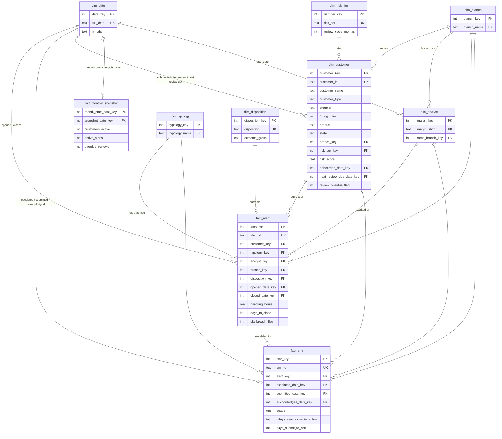
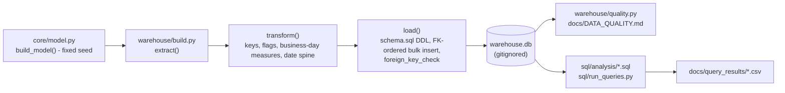

# Data model

A Kimball-style star schema in SQLite (`warehouse.db`, built by `python -m warehouse.build`, gitignored). It is loaded from the
**simulated** dataset in `core/model.py` (fixed seed), not from any real firm or AUSTRAC data. DDL: [`warehouse/schema.sql`](../warehouse/schema.sql).
Column-level detail and the source-to-target mapping: [DATA_DICTIONARY.md](DATA_DICTIONARY.md).

(The diagram shows keys and principal attributes only; every column is listed in the data dictionary.)

## Grain

| Table | Type | Grain (one row per...) | Natural / business key | Surrogate key |
|---|---|---|---|---|
| `fact_alert` | Transaction fact | monitoring alert | `alert_id` | `alert_key` |
| `fact_smr` | Transaction fact | suspicious matter report in the register (1:1 with an escalated alert) | `smr_id`, `alert_key` | `smr_key` |
| `fact_monthly_snapshot` | Periodic snapshot fact | calendar month (stock at month end, or at the as-of date for the current month) | month start date | `month_start_date_key` |
| `dim_customer` | Dimension (type 1) | client | `customer_id` (names are not unique) | `customer_key` |
| `dim_analyst` | Dimension | compliance analyst | `analyst_short` | `analyst_key` |
| `dim_typology` | Dimension | monitoring rule / typology | `typology_name` | `typology_key` |
| `dim_disposition` | Dimension | alert outcome | `disposition` | `disposition_key` |
| `dim_risk_tier` | Dimension | risk tier (Low / Medium / High) | `risk_tier` | `risk_tier_key` |
| `dim_branch` | Dimension | office | `branch_name` | `branch_key` |
| `dim_date` | Date dimension | calendar day (contiguous, with Australian financial-year attributes) | `full_date` | `date_key` = yyyymmdd |

## Design decisions

* **Additive vs non-additive measures.** `handling_hours`, `days_to_close` and the flags are additive or averageable across the alert grain. The snapshot fact's stocks (`customers_active`, `active_alerts`...) are **semi-additive**: sum across dimensions, never across months.
* **Role-playing dates.** `dim_date` is joined several times under different roles (opened, closed, submitted, acknowledged, onboarded, ...). Role is encoded in the key column name.
* **Nullable date keys instead of a sentinel row.** Open alerts have no closed date and Draft SMRs have no submitted date. The schema allows NULL only on those keys and the quality suite verifies NULL occurs if and only if the lifecycle state says so.
* **Type-1 customer dimension.** The simulator holds one current row per client, so history of risk-tier changes is not modelled. (A real implementation would use a type-2 slowly changing dimension; this is deliberately not faked here.)
* **No transaction fact.** The simulator generates alerts, not the underlying transactions, so there is no `fact_transaction`.
* **Integrity.** Foreign keys are enforced at load (`PRAGMA foreign_keys = ON` and a `foreign_key_check` after load); CHECK constraints guard flags, status, score range and hours; indexes cover every fact foreign key and the date columns used by the analysis queries.
* **Lineage / audit.** `etl_meta` records the data origin (SIMULATED), seed and as-of date; `etl_load_audit` records the row count loaded into every table.

## Pipeline

